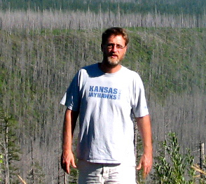
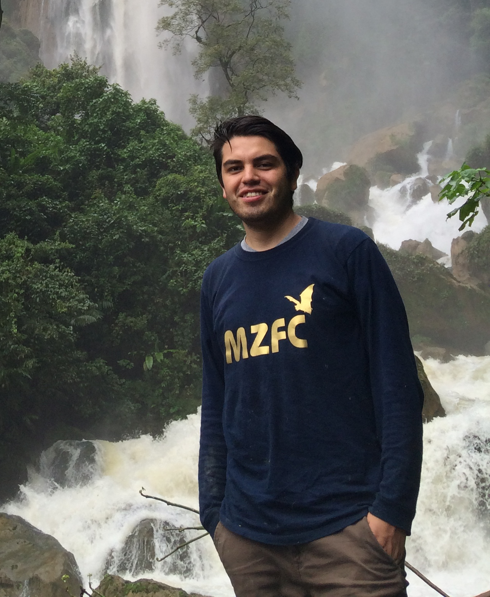
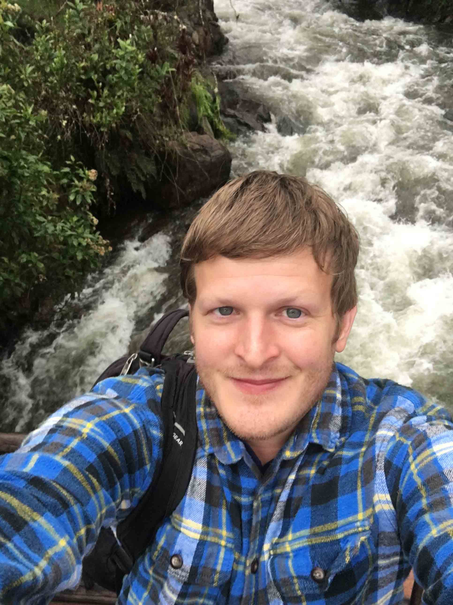
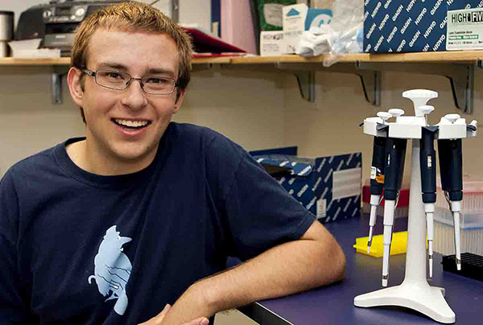
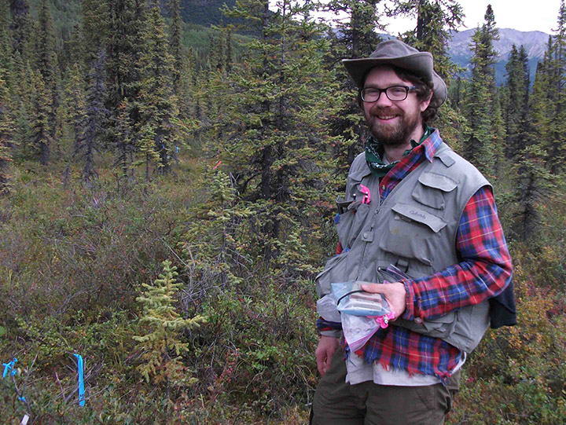
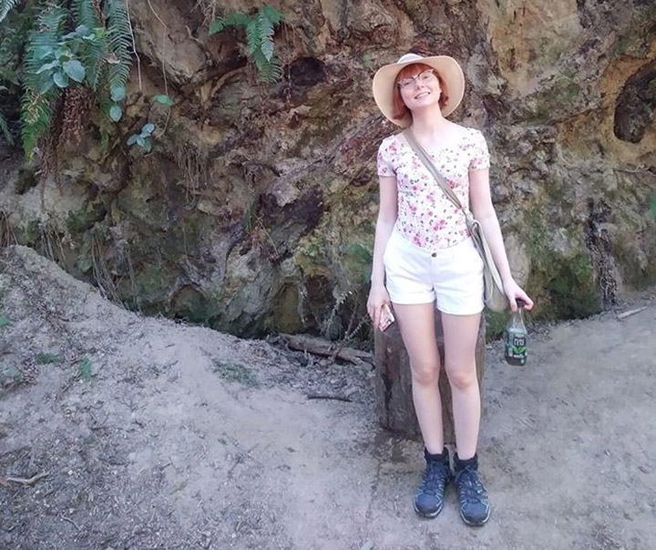
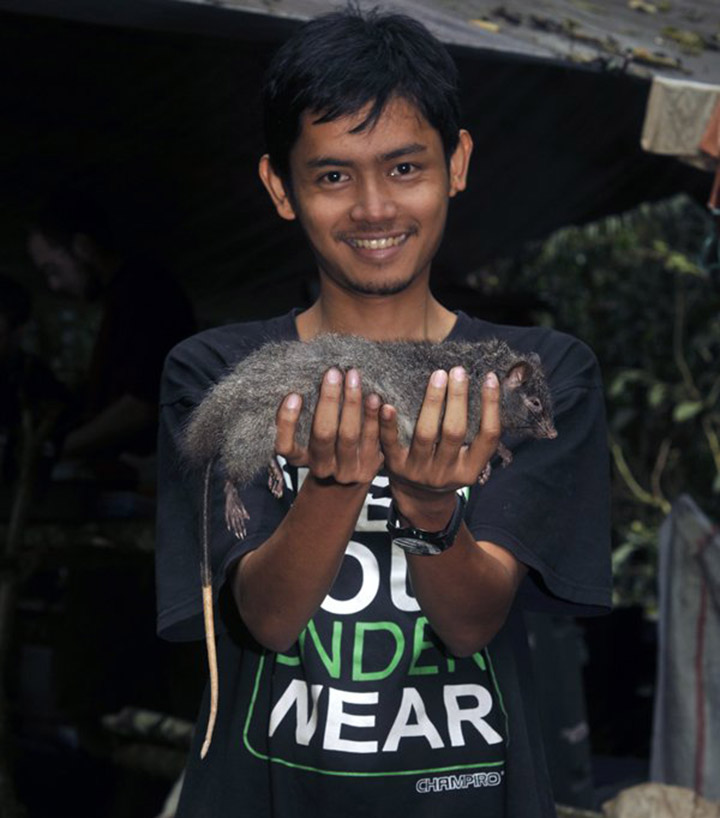

# People

**PI: Jake Esselstyn**  
I am a mammalian systematist with general interests in evolutionary biology and biogeography. My research explores questions of phylogeny, island biogeography, and taxonomy, but my students' interests expand the general lab efforts to include topics such as co-evolution and community ecology. All of our research relies heavily on voucher specimens held in natural history museums. As such, we place a premium on contributing to the growth, use, and value of museum collections. In recent years, we've collected mammal specimens in Indonesia, Malaysia, the Democratic Republic of the Congo, and the Southeastern U.S.

## Post docs:

**Giovani Hernández Canchola** is a post doctoral fellow working in the lab. He is investigating the evolutionary history and biogeography of neotropical rodents. Giovani received his PhD from the Universidad Nacional Autónoma de México in 2018. He is supported by a fellowship from the CONACyT. His Google Scholar profile is available [here](https://scholar.google.com/citations?hl=en&user=B6rbNOEAAAAJ&view_op=list_works).

**Carl Hutter** is a post doctoral scholar researching molecular evolution in rodents, as part of our project investigating rates of evolution in molecules, phenotypes, and lineages in the the adaptive radiation of Murinae. Carl received his PhD from the University of Kansas in 2019. His research interests include amphibian systematics and trait evolution, as it relates to environmental circumstances. Carl's Google Scholar profile is [here](https://scholar.google.com/citations?user=iVRhKXQAAAAJ&hl=en&oi=ao).

## Grad Students:

  

**Mark Swanson** is a PhD student studying the evolution of rodents and their microbiomes, as it relates to dietary evolution. Mark obtained his Bachelor's degree from Illinois Wesleyan University. He has contributed heavily to our efforts to better understand phylogenetic relationships among all mammals and to our field program, including participation in four expeditions to Sulawesi.  

  

**Jon Nations** is a PhD student investigating the ecomorphological evolution and community ecology of rodents. Jon received his Bachelor's degree from the University of Alaska. He is supported at LSU by a Graduate Research Fellowship from the National Science Foundation.  In addition to his own research, Jon has contributed substantially to our general goals by undertaking collecting expeditions to Malaysia and Indonesia.

  

**Spenser Babb-Biernacki** is a PhD student interested in co-evolution between mammals and their pathogenic fungi. Spenser has a Bachelor's degree from Arizona State University and is supported by a fellowship from the Louisiana Board of Regents. She is co-advised by [Vinson Doyle](https://www.lsu.edu/agriculture/plant/about/faculty-staff/doyle.php), a collaborator in LSU's Department of Plant Pathalogy and Crop Physiology.  

  

**Heru Handika** is a PhD student interested in the biogeography and systematics of Southeast Asian mammals. He received his Bachelors degree from Andalas University and his Masters degree from the University of Melbourne. Heru has joined countless field expeditions, including work on Sumatra, Java, Borneo, Sulawesi, and in the Philippines. His Masters thesis examined the systematics and biogeography of *Bunomys*, a group of mice endemic to Sulawesi.    

