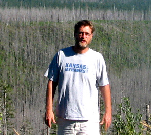
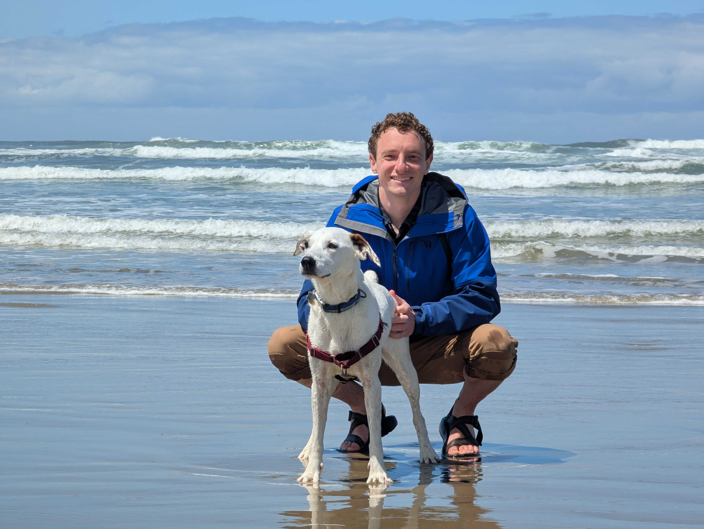
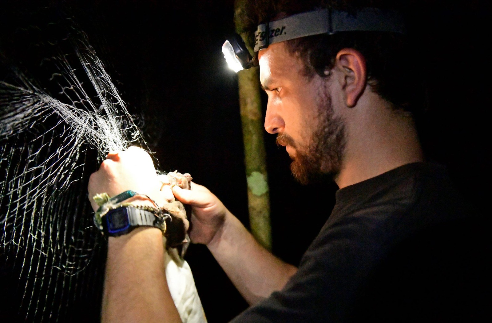
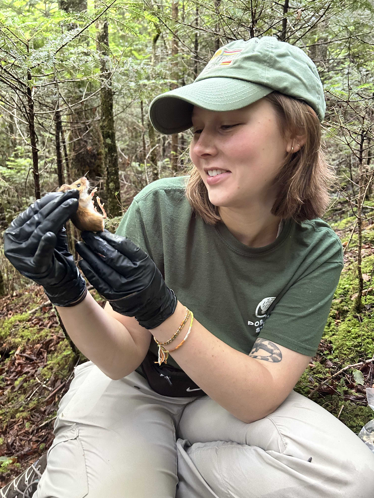
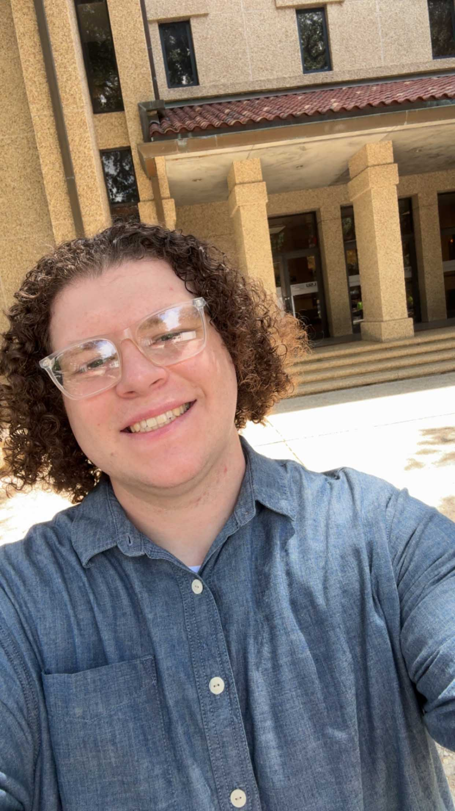

# People

**PI: Jake Esselstyn**  
I am a mammalian systematist with general interests in evolutionary biology and biogeography. My research explores questions of phylogeny, island biogeography, and taxonomy, but my students' interests expand the general lab efforts to include topics such as co-evolution and community ecology. All of our research relies heavily on voucher specimens held in natural history museums. As such, we place a premium on contributing to the growth, use, and value of museum collections. In recent years, we've collected mammal specimens in Indonesia, Malaysia, the Democratic Republic of the Congo, and the Southeastern U.S.

## Postdocs:

  

**David Sneddon** is interested evolutionary processes operating at relatively short time intervals. He received his PhD from the University of Idaho in 2025, where he studied hybridization in chipmunks. He is continuing with that work at LSU, integrating comparative genomics with phenotypic data.  ([Google Scholar](https://scholar.google.com/citations?user=RQJ0eK0AAAAJ&hl=en&oi=ao)).

## Grad Students:

  
**Darwin Morales-Martínez** is a PhD student with interests in Neotropical mammal diversity. Darwin received his BS and MS from Universidad Nacional de Colombia. He has an impressive research record, primarily focused bat systematics and natural history ([Google Scholar](https://scholar.google.com/citations?user=PJhU5VcAAAAJ&hl=es)).

  
**Claire Watersmith** is a PhD student with interests in phylogeography and conservation biology. She received her BS from North Carolina State University and her MS from the University of North Carolina Wilmington, where she studied the population genetics of woodland jumping mice.

  
**Owen Conroy** is a PhD student with interests in physiology and evolution. He received his BS from Kent State University and his MS from the University Nebraska Omaha, where he studied thermal adaptations in lizards.

## Lab Alumni:
[Spenser Babb-Biernacki](https://scholar.google.com/citations?user=8hl2znQAAAAJ&hl=en), PhD 2025  
[Austin Chipps](https://scholar.google.com/citations?user=5w8sJyIAAAAJ&hl=en), PhD 2025  
Ellie Bollich, post-bacc 2024-2025  
[Heru Handika](https://www.hhandika.com), PhD 2025  
[Giovani Hernández-Canchola](https://scholar.google.com/citations?hl=en&user=B6rbNOEAAAAJ&view_op=list_works), post-doc 2019-2021  
[Janet Buckner](https://scholar.google.com/citations?user=zmtii3oAAAAJ&hl=en&oi=ao), post-doc 2020-2021  
[Carl Hutter](https://scholar.google.com/citations?user=iVRhKXQAAAAJ&hl=en&oi=ao), post-doc 2019-2021  
[Mark Swanson](https://scholar.google.com/citations?user=Dw85wEcAAAAJ&hl=en), PhD 2021  
[Jon Nations](https://scholar.google.com/citations?user=vrqbagwAAAAJ&hl=en&oi=ao), PhD 2020  
[Terry Demos](https://scholar.google.com/citations?user=Q25QoZAAAAAJ&hl=en), post-doc 2015-2017  
Ryan Eldridge, MS 2016  
[Tom Giarla](http://www.tomgiarla.com/), post-doc 2013-2015  
