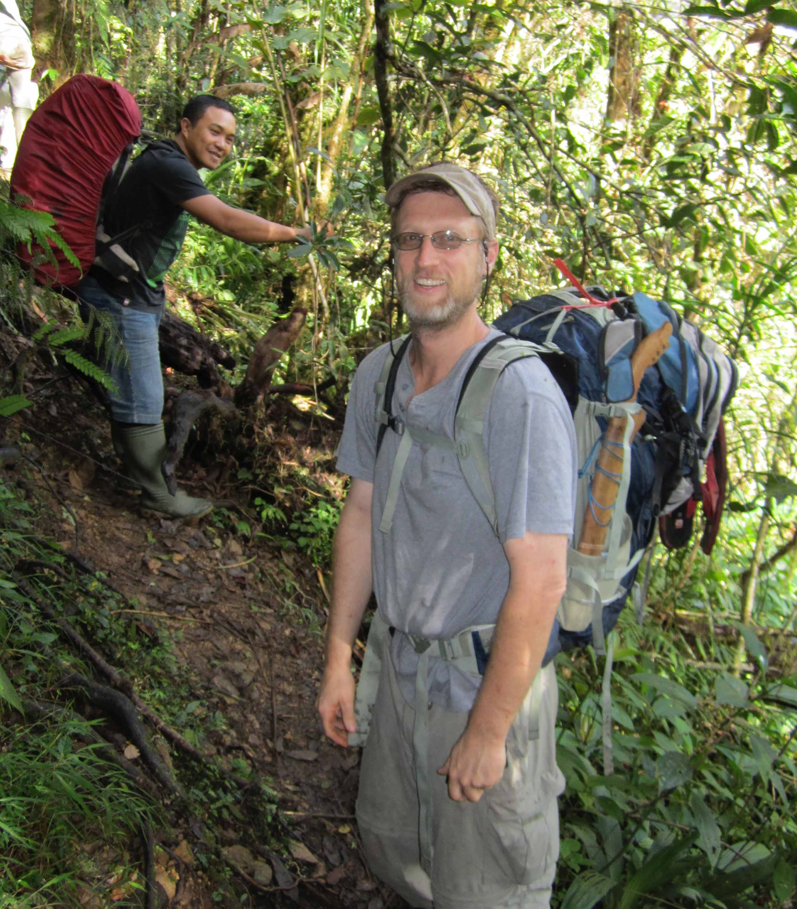
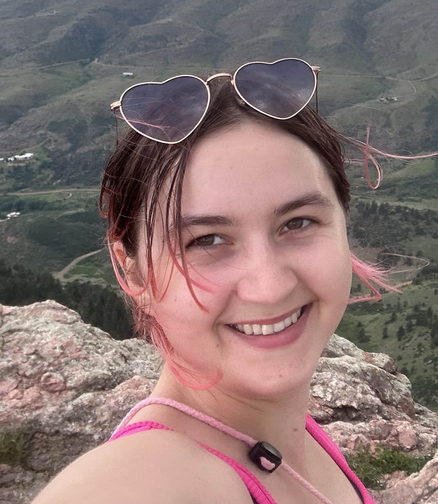

# People

**PI: Jake Esselstyn**  
I am a mammalian systematist with general interests in evolutionary biology and biogeography. My research explores questions of phylogeny, island biogeography, and taxonomy, but my students' interests expand the general lab efforts to include topics such as co-evolution and community ecology. All of our research relies heavily on voucher specimens held in natural history museums. As such, we place a premium on contributing to the growth, use, and value of museum collections. In recent years, we've collected mammal specimens in Indonesia, Malaysia, the Democratic Republic of the Congo, and the Southeastern U.S.

## Post docs:

**Carl Hutter** is a post doctoral scholar researching molecular evolution in rodents, as part of our project investigating rates of evolution in molecules, phenotypes, and lineages in the the adaptive radiation of Murinae. Carl received his PhD from the University of Kansas in 2019. His research interests include amphibian systematics and trait evolution, as it relates to environmental circumstances. Carl's Google Scholar profile is [here](https://scholar.google.com/citations?user=iVRhKXQAAAAJ&hl=en&oi=ao).

## Grad Students:

  

**Spenser Babb-Biernacki** is a PhD student interested in co-evolution between mammals and their pathogenic fungi. Spenser has a Bachelor's degree from Arizona State University and is supported by a fellowship from the Louisiana Board of Regents. She is co-advised by [Vinson Doyle](https://www.lsu.edu/agriculture/plant/about/faculty-staff/doyle.php), a collaborator in LSU's Department of Plant Pathalogy and Crop Physiology.  

  

**Heru Handika** is a PhD student interested in the biogeography and systematics of Southeast Asian mammals. He received his Bachelors degree from Andalas University and his Masters degree from the University of Melbourne. Heru has joined countless field expeditions, including work on Sumatra, Java, Borneo, Sulawesi, and in the Philippines. His Masters thesis examined the systematics and biogeography of *Bunomys*, a group of mice endemic to Sulawesi.    

  

**Austin Chipps** is a PhD student interested in population genetics and molecular evolution. He received his Bachelors degree from Central College and his Masters degree from Texas Christian University.  His Masters thesis examined the population genetics of bats in south Texas.     

  

**Darwin Morales-Martínez** is a PhD student with interests in Neotropical mammal diversity. Darwin received his BS and MS from Universidad Nacional de Colombia. He has an impressive research record, primarily focused bat systematics and natural history ([Google Scholar](https://scholar.google.com/citations?user=PJhU5VcAAAAJ&hl=es)).

## Post Baccalaureates:

  

**Ellie Bollich** is participating in the [LaGNiAppE scholars](https://www.lsu.edu/science/biosci/programs/postbacc-research/index.php) program at LSU. She is working on the systematics of Sumatran shrews. Ellie received her B.S. in Zoology from Colorado State U. in 2024.

## Lab Alumni:
[Giovani Hernández-Canchola](https://scholar.google.com/citations?hl=en&user=B6rbNOEAAAAJ&view_op=list_works), post-doc 2019-2021  
[Janet Buckner](https://scholar.google.com/citations?user=zmtii3oAAAAJ&hl=en&oi=ao), post-doc 2020-2021  
[Mark Swanson](https://scholar.google.com/citations?user=Dw85wEcAAAAJ&hl=en), PhD 2021  
[Jon Nations](https://scholar.google.com/citations?user=vrqbagwAAAAJ&hl=en&oi=ao), PhD 2020  
[Terry Demos](https://scholar.google.com/citations?user=Q25QoZAAAAAJ&hl=en), post-doc 2015-2017  
Ryan Eldridge, MS 2016  
[Tom Giarla](http://www.tomgiarla.com/), post-doc 2013-2015  
