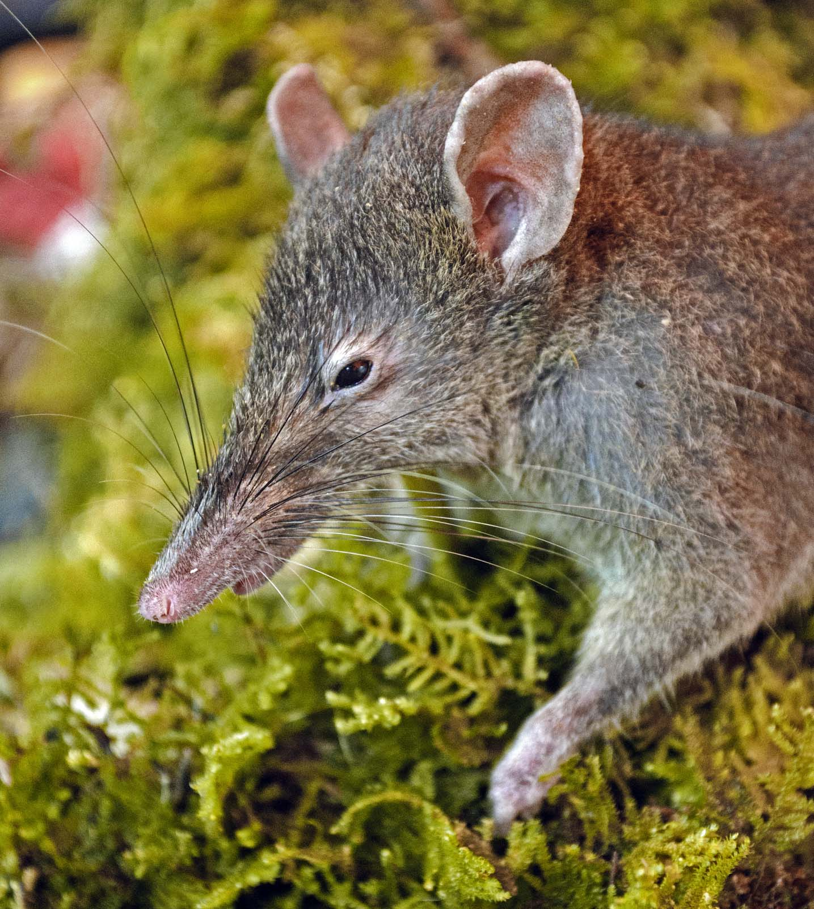

# Projects
**Systematics and diversification of Old World shrews**  
We are investigating the species-level diversity, phylogenetic relationships, and history of diversification of shrews from Asia and Africa. This work has been funded by the U.S. National Science Foundation through their Office of International Science and Engineering [OISE-0965856](http://www.nsf.gov/awardsearch/showAward.do?AwardNumber=0965856) and their systematics programs [DEB-1343517](http://nsf.gov/awardsearch/showAward?AWD_ID=1343517). Old world shrews are a diverse (~240 species) group of small mammals with a highly conserved morphology.  Their limited variation in morphology has made traditional approaches to taxonomy especially challenging and most molecular studies of this group find problems with morphologically defined species. We are therefore attempting to improve upon the current taxonomic resolution by emphasizing multilocus coalescent methods of delimiting species and estimating relationships.  Our work on this project involves field-based inventories of shrews, and assessments of morphological and genetic variation. Recent publications include resolution of issues among the shrews of Java, the Philippines, and Tanzania. 

**Rates of evolution in rats and mice**  
Adaptive radiation is a complex process of diversification that often occurs after a colonist arrives in a new biogeographic area. Diversification happens on multiple axes (species, genes, phenotypes) and we are investigating how the rates of diversification in genes, morphology, and species have varied over the evolutionary history of Murinae, a diverse clade with over 600 species that has colonized many islands in the Indo-Australian region. This project integrates comparative genomics with quantitative morphology in a phylogenetic framework. We anticipate that our results will illuminate the dynamics of diversification in lineages, phenotypes, and genes across this most species-rich adaptive radiation in mammals. Our work in this area is supported by a grant from the National Science Foundation, [DEB-1754393](https://www.nsf.gov/awardsearch/showAward?AWD_ID=1754393&HistoricalAwards=false).

**Biodiversity inventories**  
Our research is heavily dependent on knowledge of where species live and how to tell them apart.  In addition, our frequent use of genetic characters requires recently collected museum specimens with appropriately preserved tissue samples.  Thus, much of our time is devoted to inventorying small mammals.  We've done extensive fieldwork in the Philippines, Indonesia, Malaysia, the Democratic Republic of the Congo, and the Southeastern U.S. This fieldwork has supported phylogenetic and phylogeographic investigations of a number of lineages.  The ultimate goal is to contribute to an improved understanding of what species are, where they live, and how many of them are out there. 

**Mammalian phylogeny**  
With funding from NSF, [VertLife Terrestrial](http://nsf.gov/awardsearch/showAward?AWD_ID=1441634) is a collaborative effort involving partners at Yale, University of Florida, UC Berkeley, and George Washington University. Our goals are to advance knowledge of phylogenetic relationships among tetrapods, while improving the availability of on-line resources that quantify phylogenetic and trait information. More specifically, we are adding unrepresented taxa to existing phylogenetic frameworks and we are incorporating trait data into existing databases, such as the [Map of Life](https://mol.org/). At LSU, we are sequencing 1000s of loci in mammalian species that have not have not been included in previous phylogenetic estimates. Much of this effort relies on DNA extracted from dried museum skins that were collected prior to the regular preservation of frozen tissues. Ultimately, this project will provide better information on the relationships among tetrapod species, while generating critical tools for studying macroevolution, biogeography, and conservation biology.
